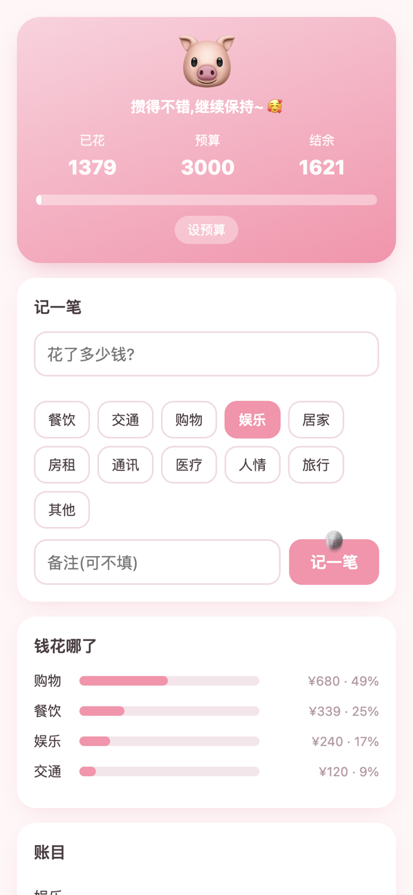
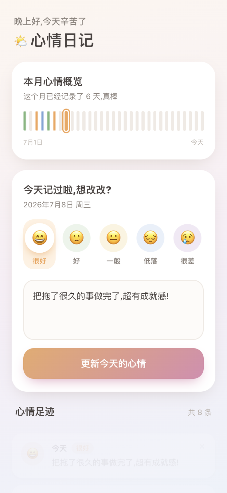
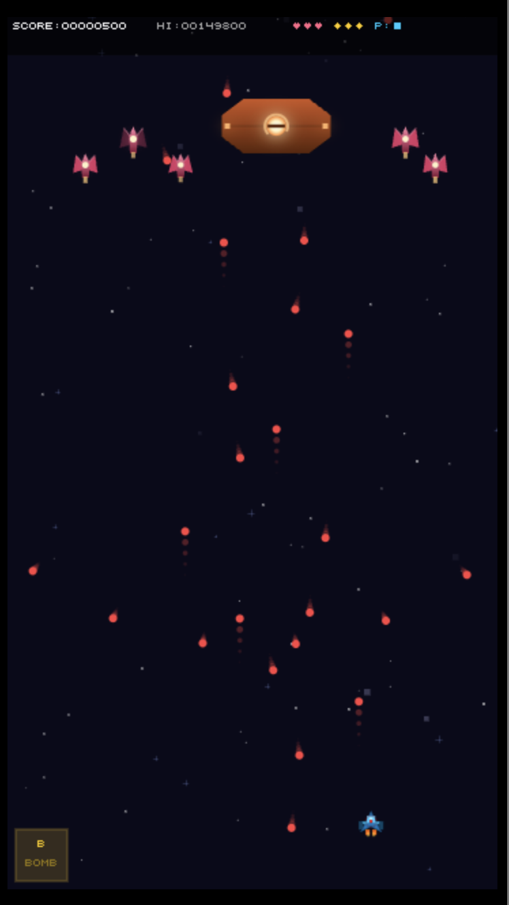
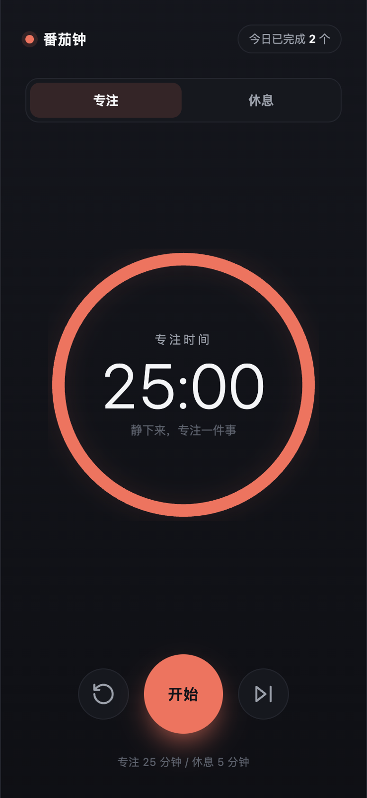
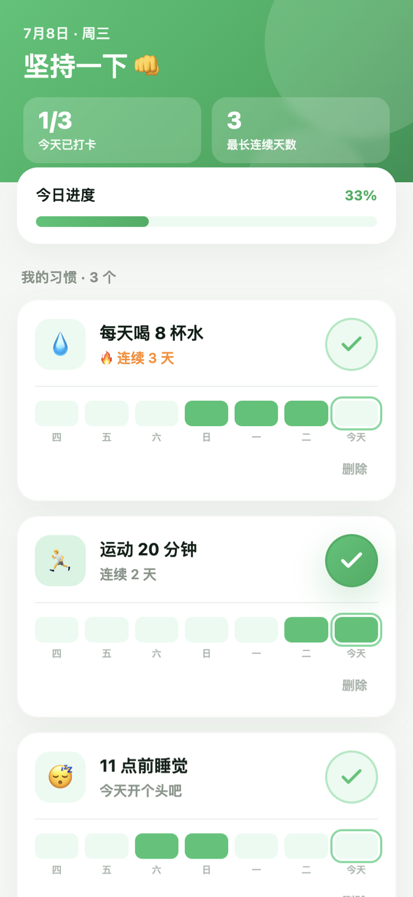

# idea-to-app

[English](README.md) | [中文](README.zh.md)

你有个 App 的点子,但不会写代码。放在以前,这事到这儿就断了。

**idea-to-app** 是一个 skill,用大白话带你从这个点子出发,七步做出一个能用、能上线的 App——打字的活交给 AI,拿主意的一直是你。走完,手里有个真东西,外加一整套记录你怎么做出来的文档。

在 Claude Code 里当 `SKILL.md` 用;其他读 `AGENTS.md` 的工具(Codex、Cursor、Windsurf、Copilot、Aider、Zed 等 20 多种)也认。一套流程,一个源头。

## 都是照这套流程做出来的

五个小 App,每个都从头到尾走了一遍 idea-to-app。全是单文件、双击就开、数据存在浏览器里。

<table>
<tr>
<td align="center" width="25%"><br><b>记账</b><br><sub>小猪存钱罐记账,超支了小猪会哭</sub></td>
<td align="center" width="25%"><br><b>心情日记</b><br><sub>每天一个表情一句话,月底看情绪起伏</sub></td>
<td align="center" width="25%"><br><b>弹幕游戏</b><br><sub>像素风 Bullethell 小游戏</sub></td>
<td align="center" width="25%"><br><b>番茄钟</b><br><sub>一个大圈,专注 25 分钟,别的没了</sub></td>
<td align="center" width="25%"><br><b>习惯打卡</b><br><sub>每天打卡,连续多少天一眼点亮</sub></td>
</tr>
</table>

记账那个还附了全套过程文档 [`examples/expense-tracker/docs/`](examples/expense-tracker/docs)——七步一路产出的六份文档,从头翻一遍就知道每步到底出什么。

## 七步

| 步骤 | 产出 |
|---|---|
| 1. 需求调研 | `docs/01-user-research.md` |
| 2. 产品设计 | `docs/02-product-design.md` |
| 3. UI/UX 结构(线框) | `docs/03-wireframe.html` |
| 4. 风格设计 | `docs/04-style.md` |
| 5. 技术选型 | `docs/05-tech-spec.md` |
| 6. 开发预览 | 产品本身 |
| 7. 部署上线 | `docs/06-deploy.md` |

每一步写一份文档、停下来等你点头、随时能回头改。全程没有术语。

## 安装

**Claude Code** —— 克隆到你的 skills 文件夹,然后说"我想做个 App"或输入 `/idea-to-app`:
```bash
git clone https://github.com/jobsteven/idea-to-app ~/.claude/skills/idea-to-app
```

**Codex、Cursor、Windsurf 等读 AGENTS.md 的工具** —— 把流程丢进项目根目录:
```bash
curl -o AGENTS.md https://raw.githubusercontent.com/jobsteven/idea-to-app/main/AGENTS.md
```

**其他任何 agent** —— 把 `AGENTS.md` 贴进那个工具的自定义指令,或开工时当 prompt 发给它。

## 许可

MIT © 2026 Eric Wong
